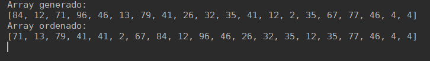

# Aprende un lenguaje de programación en un día (ejercicio voluntario para subir nota).

## Miembros del grupo

Escribe aquí los miembros del grupo. El primero es el representante o encargado.

* [Adrián Villalba](https://github.com/AdrianVillalbaSanchez)
* [Lucía Blanco](https://github.com/lucia-blanco)
* [Juanfran Bernal](https://github.com/jfbernal92)

## Lenguaje de programación
Lenguaje de programación elegido por el grupo.

* Ruby

## Información sobre el lenguaje

Ruby es un lenguaje de programación interpretado, reflexivo y orientado a objetos, creado por el programador japonés Yukihiro "Matz" Matsumoto, quien comenzó a trabajar en Ruby en 1993, y lo presentó públicamente en 1995. Combina una sintaxis inspirada en Python y Perl con características de programación orientada a objetos similares a Smalltalk.

Lenguaje de guiones interpretado:  
• Posibilidad de realizar directamente llamadas al sistema operativo  
• Potentes operaciones sobre cadenas de caracteres y expresiones regulares  
• Retroalimentación inmediata durante el proceso de desarrollo  

Rápido y sencillo:  
• Son innecesarias las declaraciones de variables  
• Las variables no tienen tipo  
• La sintaxis es simple y consistente  
• La gestión de la memoria es automática  

Programación orientada a objetos:  
• Todo es un objeto  
• Clases, herencia, métodos, ...  
• Métodos singleton  
• Mixins por módulos  
• Iteradores y cierres  

## Herramientas de desarrollo

Para instalar Ruby en Windows, descarga [Ruby Installer](http://dl.bintray.com/oneclick/rubyinstaller/rubyinstaller-2.0.0-p451.exe?direct). Luego, ejecuta el instalador, sigue los pasos de instalación y listo.

Para instalarlo en Ubuntu escribe lo siguiente en la terminal:

```java
sudo apt-get install ruby
```

## Poniendo en práctica el lenguaje

Para hacer un programa en Ruby basta con escribir en un fichero de texto el código y guardarlo con la extensión _.rb_  
Para ejecutarlo hay que poner en la terminal lo siguiente:  

```java

ruby nombredelfichero.rb

```

### 1. ¡Hola mundo!

Realiza un programa que muestre por pantalla la frase **¡Hola mundo!**.
```ruby
puts "¡Hola Mundo!"
```  


### 2. Pirámide

Dada una altura introducida por el usuario, realiza un programa que pinte una pirámide a base de asteriscos con la altura indicada.
```ruby
puts "Introduce la altura de la pirámide"
h = gets.chomp.to_i.abs

c = '*'
valor = c

for i in 1..h
	puts " "*(h - i)+valor
	valor += c*2
end
```


### 3. Arrays y números aleatorios

Realiza un programa que rellene un array (o una estructura similar) con 20 números enteros aleatorios entre 1 y 100 y que seguidamente los muestre por pantalla. A continuación, se deben pasar los números primos a las primeras posiciones del array y los no primos a las posiciones restantes. Muestra finalmente el array resultado.
```ruby
 numeros = Array.new(20)
for i in 0..numeros.length
	numeros[i] = rand(100)
end
for i in 0..numeros.length
	puts numeros[i]
end
<<<<<<< HEAD
```



## Presentación de resultados

Cada equipo explicará al resto de la clase lo aprendido durante la realización del ejercicio. Todos los miembros de cada equipo deben participar en la explicación. Se puede utilizar como material de base para la presentación el repositorio de GitHub.

## Recompensa

* Todos los alumnos que realicen correctamente la actividad tendrán 0'25 puntos extra en la nota del trimestre.

* Los miembros del equipo más votado ganarán un premio.

=======
```  
>>>>>>> 51b3c19e22a09d2237d0fb3b701ce41bceddf2ff
:star: Si te ha gustado este ejercicio, dale una estrellita al [repositorio original](https://github.com/LuisJoseSanchez/aprende-un-lenguaje-en-un-dia).

